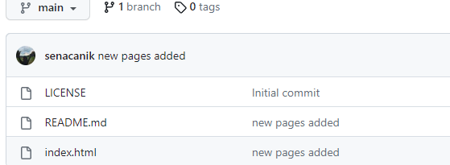

# Kodluyoruz Ilk Repo
Bu repo [Kodluyoruz](https://www.patika.dev/tr) Front-End Eğitiminde oluşturduğumuz ilk repo. İçerisinde bir adet README dosyası, bir adet de index.html barındırıyor.
> https://github.com/senacanik/kodluyoruzilkrepo.git

## Installation
Öncelikle projeyi clonelayın. (Buraya sizin reponuzdan aldığınız link gelecek)
> https://github.com/senacanik/kodluyoruzilkrepo.git

## Usage
Projeyi cloneladıktan sonra Visual Studio Code programında açınız.
Linux için:
> cd kodluyoruzilkrepo 
>
>code

# Contributing
Pull requestler kabul edilir. Büyük değişiklikler için, lütfen önce neyi değiştirmek istediğinizi tartışmak için bir konu açınız.

# Kodluyoruz
> [PATİKA](https://www.patika.dev/tr)

# License
> [MIT](https://choosealicense.com/licenses/mit/)
